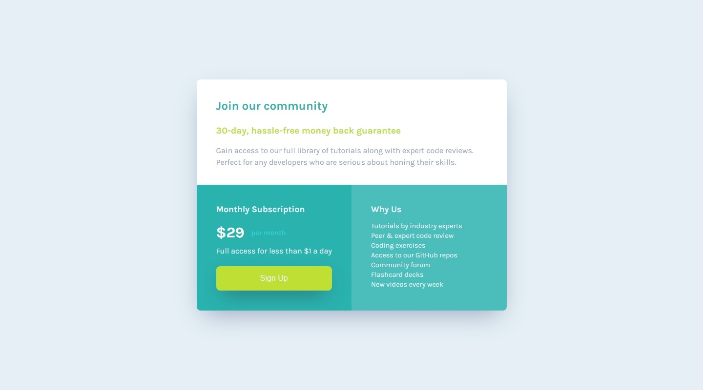

# Frontend Mentor - Single price grid component solution

This is a solution to the [Single price grid component challenge on Frontend Mentor](https://www.frontendmentor.io/challenges/single-price-grid-component-5ce41129d0ff452fec5abbbc). Frontend Mentor challenges help you improve your coding skills by building realistic projects.

## Table of contents

- [Overview](#overview)
  - [The challenge](#the-challenge)
  - [Screenshot](#screenshot)
  - [Links](#links)
- [My process](#my-process)
  - [Built with](#built-with)
  - [What I learned](#what-i-learned)
  - [Continued development](#continued-development)
  - [Useful resources](#useful-resources)
- [Author](#author)
- [Acknowledgments](#acknowledgments)

## Overview

### The challenge

Users should be able to:

- View the optimal layout for the component depending on their device's screen size
- See a hover state on desktop for the Sign Up call-to-action

### Screenshot




### Links

- Solution URL: [Solution on GitHub](https://github.com/horoserp/single-price-grid)
- Live Site URL: [Live Site](https://horoserp.github.io/single-price-grid)

## My process

### Built with

- Semantic HTML5 markup
- CSS custom properties
- Flexbox
- CSS Grid

### What I learned

- I was able to utilize the CSS property:value pair of Overflow:Hidden to solve issues with the border-radius not working on the card.
- I continued applying new learning in the form of :where() (for grouping selectors), @media (hover:hover) (to prevent errors with hover when the device is not hoverable) and &:active (CSS nesting).
- I gained practice using CSS Grids, especially in the form of grid-template-areas.
- I gained practice with Semantic HTML by adding a hidden h1 tag for the section.

```html
<section>
  <h1 class="visually-hidden">Pricing and Information Grid</h1>
</section>
```

```css
.container {
  display: grid;
  grid-template-areas:
    "header header"
    "pricing benefits";
}
```

```css
.sign-up {
  &:active {
    background-color: white;
    color: var(--Bright-Yellow);
  }
}
```

### Continued development

I hope to build off of this success and continue exploring new ways to use CSS.

### Useful resources

- [W3Schools](https://www.w3schools.com/) - This is a great reference site which helped me remember some of the required syntax.
- [Stack Overflow](https://stackoverflow.com/) - This is an excellent resource for finding answers to precise questions.

## Author

- Website - [Robert P. Horosewski](https://horoserp.github.io/React-Portfolio)
- Frontend Mentor - [@horoserp](https://www.frontendmentor.io/profile/horoserp)
- LinkedIn - [Robert P. Horosewski](https://www.linkedin.com/in/robert-horosewski-8a0608196/)

## Acknowledgments

Thanks to my wife for the encouragement to pursue my dream. Thanks to my sister and brother-in-law for their continued support.
